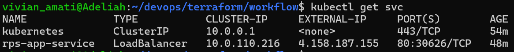
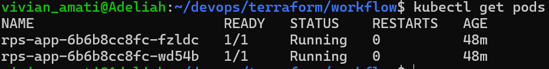
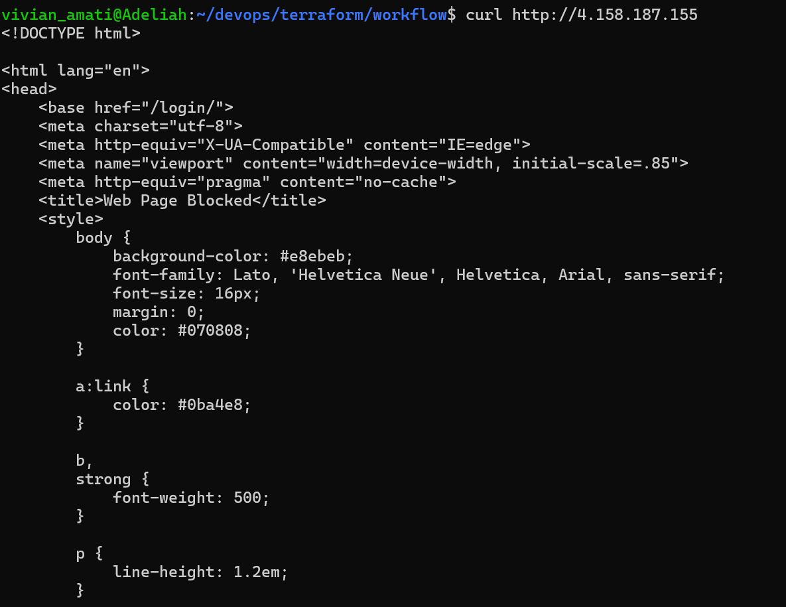
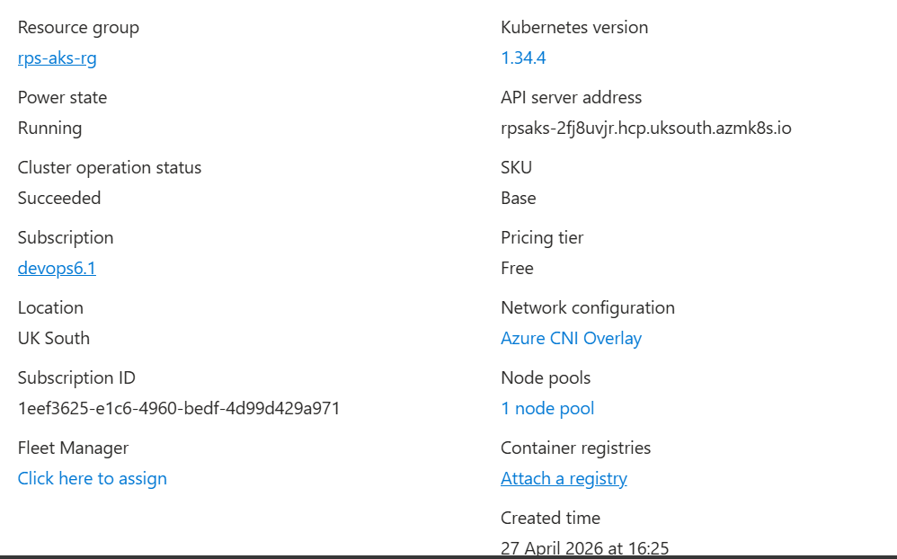
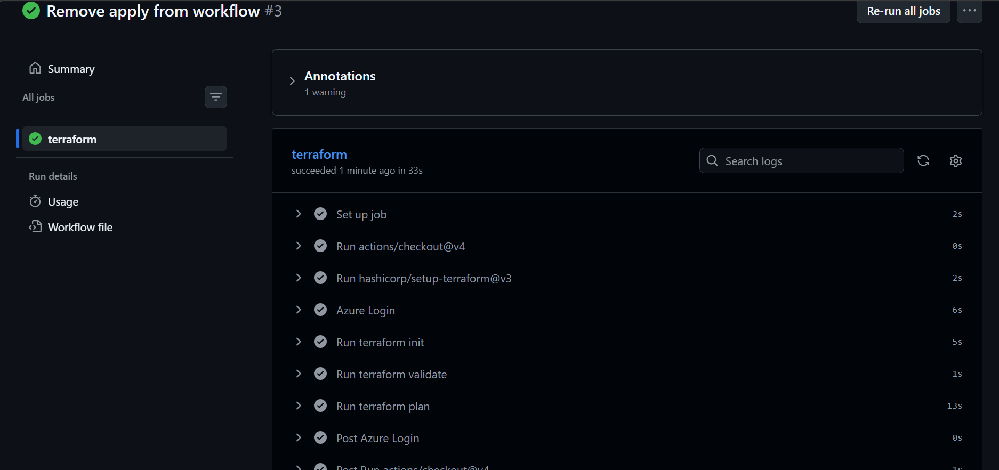

Deploying a Python Web Application to Azure Kubernetes Service (AKS) using Terraform

Project Overview

This project demonstrates how to use Terraform to provision cloud infrastructure on Azure and deploy a containerized Python web application to an Azure Kubernetes Service cluster.

I packaged the application using Docker and exposed it to the internet using a Kubernetes LoadBalancer service.

Architecture

The deployed architecture includes:

Azure Resource Group – logical container for resources
AKS – managed Kubernetes cluster
Kubernetes Deployment – runs the Python application container
Kubernetes Service (LoadBalancer) – exposes the application publicly

Deployment Flow

1. Terraform provisions the Azure Resource Group and AKS cluster
2. Terraform configures the Kubernetes provider using AKS credentials
3. A Kubernetes Deployment is created to run the application container
4. A LoadBalancer Service exposes the application via a public IP


Project Structure

```
.
├── main.tf
├── providers.tf
├── variables.tf
├── outputs.tf
├── service.tf
├── app.py
├── Dockerfile
├── requirements.txt
├── .gitignore
├── README.md
└── .github/workflows/terraform.yml
```
How to Initialize and Apply Terraform Locally
1. Login to Azure

```
az login
```
2. Initialize Terraform

```
terraform init
```

3. Validate configuration

```
terraform validate
```

4. Review execution plan

```
terraform plan
```

5. Apply infrastructure

```
terraform apply
```

Variables

Terraform uses variables defined in `variables.tf`, including:

`resource_group_name`
`location`
`cluster_name`
`node_count`
`node_size`
`image`

Backend Configuration

For this project, Terraform state is stored locally.
In a production environment, a remote backend would be used to securely manage state and enable team collaboration.

Handling Credentials and Sensitive Data

Local Development

Authentication is done using:

  ```
  az login
  ```

GitHub Actions (CI/CD)

* Azure authentication is handled using a **Service Principal**
* Credentials are stored securely in GitHub Secrets:

```
AZURE_CREDENTIALS
```

This prevents sensitive data from being exposed in the repository.

Additional Security Considerations

In a production setup, sensitive data such as:

* Database credentials
* API keys
* Container registry secrets

would be managed using:

* **Azure Key Vault**
* **Kubernetes Secrets**

Accessing the Deployed Application

After deployment, retrieve the public IP:

```
kubectl get svc
```

Example output:

```
rps-app-service   LoadBalancer   4.158.187.155
```

Access the application in a browser:

```
http://<EXTERNAL-IP>
```

If access is restricted (e.g., corporate network), use:

```
curl http://<EXTERNAL-IP>
```
Building and Pushing the Application Image

Before Terraform can deploy the application, the Docker image must exist in a registry.

Build the image

```
docker build -t yourusername/rps-app .
```

Push to Docker Hub

```
docker push yourusername/rps-app
```


Terraform references this image:

```
yourusername/rps-app:latest
```

In a real-world CI/CD pipeline, this step would be automated.

CI/CD Pipeline (GitHub Actions)

The workflow is defined in:

```
.github/workflows/terraform.yml
```
Pipeline Behavior

On Pull Requests:

* terraform init
* terraform validate
* terraform plan

On Push to main:

* Same steps executed (no automatic apply for safety)


Screenshots

Kubernetes Service



Running Pods



Application Response



AKS Cluster in Azure



GitHub Actions Pipeline




Proof of Deployment

* AKS cluster successfully provisioned
* Kubernetes resources deployed
* Application accessible via public IP
* CI/CD pipeline successfully executes Terraform plan

Notes

* `.terraform/` and `.tfstate` files are excluded using `.gitignore`
* Sensitive credentials are not committed to the repository
* Infrastructure was verified using both CLI and Azure Portal

Conclusion

This project demonstrates:

* Infrastructure as Code using Terraform
* Deployment of containerized applications to Kubernetes
* Integration with GitHub Actions for CI/CD
* Secure handling of cloud credentials

Author
Vivian Amati

Repository
https://github.com/va24aaf/terraform

